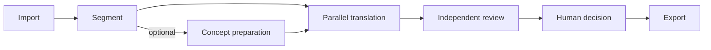

# Mode2 AutoTranslator

**A local, reviewable document translation workbench for Windows.**

  

[English](#mode2-autotranslator) · [简体中文](#simplified-chinese)

Mode2 turns long documents into traceable units: optionally analyze source concepts, check candidates against evidence, and prepare applicable meaning and terminology references before translating in parallel. A separately configured reviewer checks saved translations; you can edit, recheck, retry, or explicitly accept risk before export. It uses OpenAI-compatible APIs that **you configure**.

**[Download the latest Windows ZIP](https://github.com/ynian2754-droid/Mode2-AutoTranslator-MVP/releases/latest)** · [Quick start](#quick-start-windows) · [User guide (简体中文)](USER_GUIDE.md)

*A real Mode2 screen from a synthetic, offline demo project. The saved Chinese translation and review result are demonstration data, not evidence of live-model quality.*

## Screenshots

These are captures from a completed local demo using a synthetic source document and offline sample translation and review responses. They show the actual interface and exported file, **not a live provider evaluation**. [Image notes and provenance](docs/images/README_SCREENSHOTS.md).

### Prepare concepts with source evidence

The card keeps a meaning, applicable context, candidate translation, and source evidence together. Its automatic adoption is labeled separately from manual approval; the Chinese term and explanation are saved project content.

### Export the finished document

This is the actual PDF produced from the completed demo project. The sample text identifies itself as synthetic; the capture illustrates document output, not translation accuracy or source-layout preservation.

More views: project library, progress, and concept preparation

The project library shows the imported Markdown source and its eight translation units.

The workbench overview shows completion status, progress, output format, and the export control.

The preparation view shows three adopted references from the saved demo run. The selected scope shown at the top was changed after that run; stage counters marked “To be determined” are not presented as measured results.

## Why Mode2?

A file translation script typically returns translated text. Mode2 keeps the source location, translation, review result, and human decision attached to each unit. Its optional concept workflow proposes cards with source evidence, checks them independently, and prepares eligible meaning and preferred-term references for the units where they apply. The workbench records which references a translation actually used; automatic adoption is distinct from human approval. The reviewer is a separate step with its own API settings, though you may configure the same service for both translation and review.

## Quick start (Windows)

1. [Download the latest Release ZIP](https://github.com/ynian2754-droid/Mode2-AutoTranslator-MVP/releases/latest) and extract it. This is the simplest starting point for users who do not need Git; the ZIP is **not** a portable executable.
2. Install **Python 3.10 or later with pip** separately, then run `安装依赖.bat` once in the extracted folder. The package does not include Python or a model service.
3. Run `启动.bat`. Open `http://127.0.0.1:4873/` if your browser does not open automatically; configure and test both the translation and review OpenAI-compatible endpoints before processing a document.

Create a project, import a file, and select the units to process. Concept preparation is optional: previewing its plan makes no model call, while confirming preparation does. See the [user guide](USER_GUIDE.md) for the full workflow and troubleshooting. PowerShell users can start with `./run.ps1`; `启动.bat 4874` uses a different port.

## What you can do

- **Work by project and unit.** Import a document, inspect source locations and unit status, and process selected units concurrently. Each unit is saved before its review starts.
- **Prepare concept references.** Generate candidate meanings and terms from source text, inspect evidence and independent checks, resolve or defer ambiguous cases, and choose automatic or manual reference handling. Only applicable references are eligible for a unit; a saved reference is not a guarantee that every request uses it.
- **Review and decide.** Read reviewer findings, edit a translation and recheck it, retry translation, or mark an explicit `accepted_risk` decision. Saved translations and review records remain available in the project.
- **Export a complete document.** Reassemble export-ready units in source order and produce a trace map alongside the output.

## Formats and workflow

| | Supported formats | Notes |
| --- | --- | --- |
| Import | PDF, EPUB, Markdown (`.md`, `.markdown`), TXT | PDF needs a text layer; scanned PDFs require OCR first. |
| Export | Markdown, TXT, EPUB, PDF | Output is written to the project's `output/` folder; PDF and EPUB are reconstructed documents. |

The app runs in a local browser on Windows. Its project selector, translation workspace, concept page, and settings page support English and Simplified Chinese; Simplified Chinese is the default interface language.

## Data, providers, and privacy

Projects, source copies, saved translations, reviews, and exports live under `book/<project>/`. API settings, which may include API keys, live in `.runtime/api_settings.json`. Both directories are Git-ignored and are excluded from the v0.2.1 Release ZIP; protect your local settings file and keep credentials out of screenshots and issue reports.

The app does not bundle an API key or model. When you test an endpoint or run translation, review, or concept preparation, it calls the endpoint you configured. Depending on the action, requests can contain source units or excerpts, adjacent source context, saved translations, candidate concepts, and applicable references. Your provider's access, billing, and data-handling terms apply.

## Current limits

- DOCX import and OCR are not included. Convert DOCX first; OCR a scanned PDF before importing it.
- PDF export is reflowed, not a visual copy of the source. EPUB export does not promise preservation of every image, complex style, or interactive element.
- Provider compatibility, translation quality, cost, and rate limits depend on the service you configure. The [v0.2.1 Release](https://github.com/ynian2754-droid/Mode2-AutoTranslator-MVP/releases/tag/v0.2.1) reports package checks, but no fresh Windows installation or live model calls; concept preparation has only offline validation so far.

## Documentation and license

The [user guide](USER_GUIDE.md) covers installation, API setup, concept preparation, translation, review, export, and troubleshooting (currently in Simplified Chinese). [Screenshot notes](docs/images/README_SCREENSHOTS.md) identify the demo images and their limits.

Original source code and documentation are [MIT licensed](LICENSE). Bundled PDF fonts retain their upstream licenses; see [third-party notices](THIRD_PARTY_NOTICES.md) and the license files under `assets/fonts/pdf/`.

---

## 简体中文

Mode2 AutoTranslator 是在 Windows 本机运行、可逐单元审阅的文档翻译工作台。它将长文档切成可追踪单元；翻译前可先解析原文概念、独立检查候选及原文依据，为适用单元准备含义和术语参考。之后可并行翻译、单独校验，人工修改或明确接受风险，再导出完整文档。翻译、校验和概念准备调用由你配置的 OpenAI-compatible 接口；自动采用的概念参考不等于人工批准，也不保证每次请求都使用。

**[下载最新 Release ZIP](https://github.com/ynian2754-droid/Mode2-AutoTranslator-MVP/releases/latest)** · [产品截图](#screenshots) · [使用与排错指南](USER_GUIDE.md)

### 快速开始

1. 解压 Release ZIP；另行安装带 pip 的 Python 3.10+，然后在解压目录运行一次 `安装依赖.bat`。ZIP 不是免安装可执行程序，也不附带 Python 或模型服务。
2. 运行 `启动.bat`，浏览器未自动打开时访问 `http://127.0.0.1:4873/`。
3. 配置并测试翻译与校验接口，新建项目、导入文件并选择待处理单元。概念准备是可选步骤；预览计划不调用模型，确认执行后才会调用。

支持导入 PDF、EPUB、Markdown、TXT，导出 Markdown、TXT、EPUB、PDF。扫描 PDF 需先 OCR，暂不支持 DOCX；PDF/EPUB 输出不能保证复刻原版式。项目与源文件保存在 `book/<项目名>/`，可能含密钥的接口设置保存在 `.runtime/api_settings.json`。调用你配置的服务时，相关原文、译文、上下文或概念参考可能发送给该服务；请遵守其数据与计费规则。

本项目自有源码和文档采用 [MIT License](LICENSE)。内置 PDF 字体保留上游许可，见[第三方组件说明](THIRD_PARTY_NOTICES.md)。最新 Release 尚未完成全新 Windows 安装和真实模型翻译验证。
