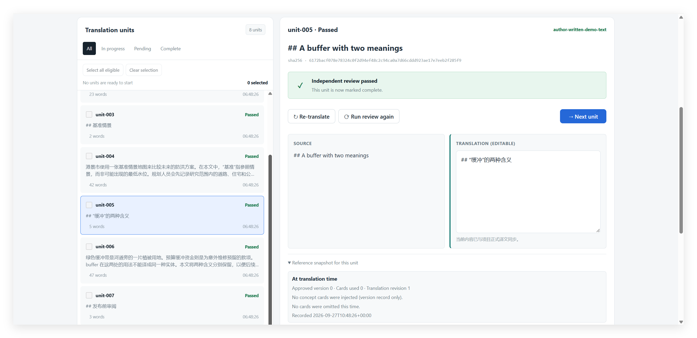
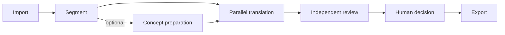
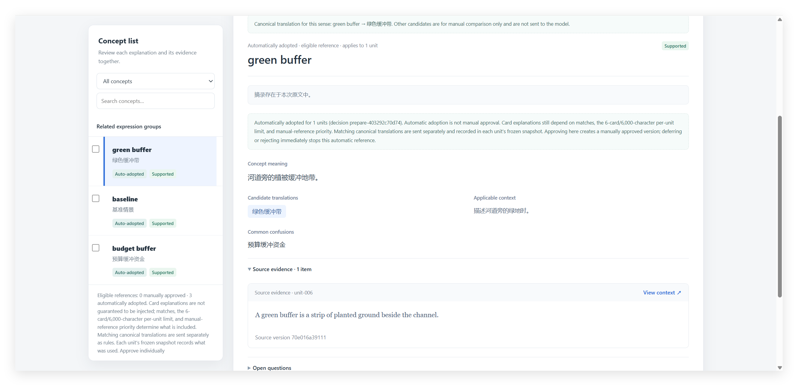
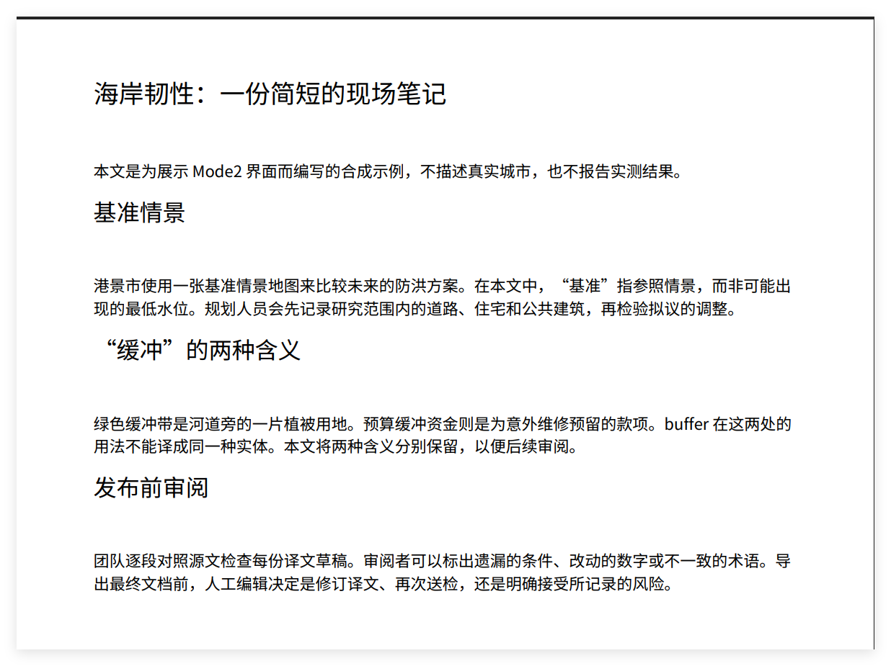
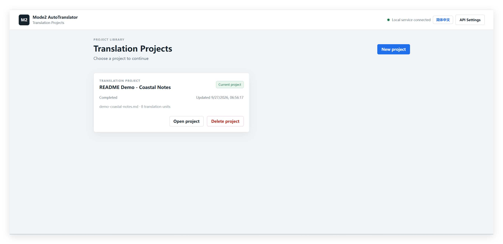
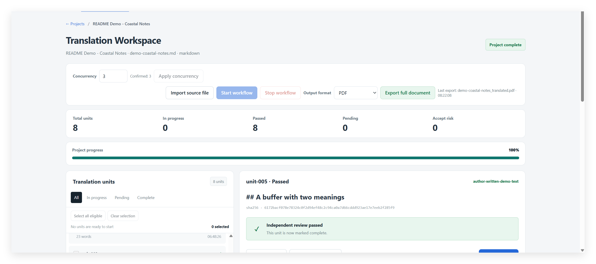
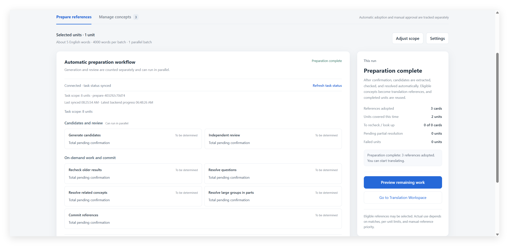

# Mode2 AutoTranslator

**A local, reviewable document translation workbench for Windows.**

  

[English](#mode2-autotranslator) · [简体中文](#simplified-chinese)

Mode2 breaks long documents into traceable translation units, translates them in parallel, and checks each result with a separately configured reviewer. You can inspect or edit units before export. Optional concept preparation helps keep meaning and terminology consistent across the document. Connect your own OpenAI-compatible APIs.

**Latest release: v0.2.4 (2026-10-01).** This release reorganizes the pipeline internals, reduces redundant work when loading large concept projects, and completes English translations across the quality results page. See the [bilingual release notes](CHANGELOG.md).

**中文速览：** 本地导入与切分文档，可先做概念辨析，再并行翻译、独立校验、人工审阅并导出。[查看完整中文说明](#simplified-chinese)。

**[Download the latest Windows ZIP](https://github.com/ynian2754-droid/Mode2-AutoTranslator-MVP/releases/latest)** · [Quick start](#quick-start-windows) · [English user guide](USER_GUIDE.en.md) · [简体中文手册](USER_GUIDE.md)

The workbench keeps source text, an editable translation, review status, and the unit's reference snapshot together.

> **Demo note / 演示说明：** Screenshots use a synthetic offline demo project and illustrate the actual Mode2 workflow and export UI. They are not benchmarks of model translation quality.
>
> 截图使用合成内容与离线演示项目，展示真实工作流和导出界面，不代表模型翻译质量基准。

## Screenshots

See the [image notes](docs/images/README_SCREENSHOTS.md) for the six captures and their context.

### Prepare concepts with source evidence

The card shows its meaning, applicable context, candidate translation, source evidence, and automatic adoption status.

### Export the finished document

The exported PDF shows the completed document with reflowed Chinese headings and paragraphs.

More views: project library, progress, and concept preparation

The project library shows the imported Markdown source and its eight translation units.

The workbench overview shows completion status, progress, output format, and the export control.

The preparation view shows three adopted references and the workflow overview.

## Why Mode2?

A file translation script typically returns translated text. Mode2 keeps the source location, translation, review result, and human decision attached to each unit. Its optional concept workflow proposes cards with source evidence, checks them independently, and prepares eligible meaning and preferred-term references for the units where they apply. The workbench records which references a translation actually used; automatic adoption is distinct from human approval. The reviewer is a separate step with its own API settings, though you may configure the same service for both translation and review.

## Quick start (Windows)

1. [Download the latest Release ZIP](https://github.com/ynian2754-droid/Mode2-AutoTranslator-MVP/releases/latest) and extract it. This is the simplest starting point for users who do not need Git; the ZIP is **not** a portable executable.
2. Install **Python 3.10 or later with pip** separately, then run `安装依赖.bat` once in the extracted folder. The package does not include Python or a model service.
3. Run `启动.bat`. Open `http://127.0.0.1:4873/` if your browser does not open automatically; configure and test both the translation and review OpenAI-compatible endpoints before processing a document.

Create a project, import a file, and select the units to process. Concept preparation is optional: previewing its plan makes no model call, while confirming preparation does. See the [English user guide](USER_GUIDE.en.md) for the full workflow and troubleshooting; the [Simplified Chinese guide](USER_GUIDE.md) is also available. PowerShell users can start with `./run.ps1`; `启动.bat 4874` uses a different port.

## What you can do

- **Work by project and unit.** Import a document, inspect source locations and unit status, and process selected units concurrently. Each unit is saved before its review starts.
- **Prepare concept references.** Generate candidate meanings and terms from source text, inspect evidence and independent checks, resolve or defer ambiguous cases, and choose automatic or manual reference handling. Only applicable references are eligible for a unit; a saved reference is not a guarantee that every request uses it.
- **Review and decide.** Read reviewer findings, edit a translation and recheck it, retry translation, or mark an explicit `accepted_risk` decision. Saved translations and review records remain available in the project.
- **Export a complete document.** Reassemble export-ready units in source order and produce a trace map alongside the output.

## Formats and workflow

| | Supported formats | Notes |
| --- | --- | --- |
| Import | PDF, EPUB, Markdown (`.md`, `.markdown`), TXT | PDF needs a text layer; scanned PDFs require OCR first. |
| Export | Markdown, TXT, EPUB, PDF, Word (`.docx`) | Output and its trace map are written to the project's `output/` folder. Word is editable and reflows pages; PDF and EPUB are reconstructed documents. |

The app runs in a local browser on Windows. Its project selector, translation workspace, concept page, and settings page support English and Simplified Chinese; Simplified Chinese is the default interface language.

## Data, providers, and privacy

Projects, source copies, saved translations, reviews, and exports live under `book/<project>/`. API settings, which may include API keys, live in `.runtime/api_settings.json`. Both directories are Git-ignored and excluded from Release ZIPs; protect your local settings file and keep credentials out of screenshots and issue reports.

The app does not bundle an API key or model. When you test an endpoint or run translation, review, or concept preparation, it calls the endpoint you configured. Depending on the action, requests can contain source units or excerpts, adjacent source context, saved translations, candidate concepts, and applicable references. Your provider's access, billing, and data-handling terms apply.

## Current limits

- DOCX import and OCR are not included. Convert DOCX first; OCR a scanned PDF before importing it.
- PDF export is reflowed, not a visual copy of the source. EPUB export does not promise preservation of every image, complex style, or interactive element.
- Provider compatibility, translation quality, cost, and rate limits depend on the service you configure.

## Documentation and license

The [English user guide](USER_GUIDE.en.md) and [Simplified Chinese guide](USER_GUIDE.md) cover installation, API setup, concept preparation, translation, review, export, and troubleshooting. The [bilingual release notes](CHANGELOG.md) describe changes by version. [Screenshot notes](docs/images/README_SCREENSHOTS.md) identify the demo images and their limits.

Original source code and documentation are [MIT licensed](LICENSE). Bundled PDF fonts retain their upstream licenses; see [third-party notices](THIRD_PARTY_NOTICES.md) and the license files under `assets/fonts/pdf/`.

---

## 简体中文

**Mode2 AutoTranslator 是在 Windows 本机运行、可逐单元审阅的文档翻译工作台。** 它把文档切成可追踪单元；翻译前可以先辨析原文概念、核对候选和证据，为适用单元准备含义与术语参考。随后并行翻译、独立校验，留给人逐段修改、复检或明确接受风险，最后导出完整文档。模型服务由你通过 OpenAI-compatible API 配置。

**[下载最新 Release ZIP](https://github.com/ynian2754-droid/Mode2-AutoTranslator-MVP/releases/latest)** · [产品截图](#screenshots) · [使用与排错指南](USER_GUIDE.md) · [English user guide](USER_GUIDE.en.md)

**最新版本：v0.2.4（2026-10-01）。** 本版拆分了 pipeline 内部职责、减少大型概念项目加载时的重复处理，并补齐质量结果页的英文界面。[查看中英双语更新说明](CHANGELOG.md)。

### 为什么用 Mode2

普通文件翻译脚本往往只给出一份译文。Mode2 保留每个单元的原文位置、已保存译文、校验结果和人工决定。可选的概念准备会提出候选含义与译名，附上原文依据并进行独立检查；人工可以逐卡处理，也可以使用有条件的自动采用。工作台记录每个单元实际用过的参考快照。**自动采用不等于人工批准**，保存的参考也不保证每次都会注入。翻译与 reviewer 分步配置；两者可以使用同一家服务。

### 截图导览

这些图片依次展示单元审阅、概念卡和实际导出的 PDF。

- [单元审阅与人工编辑](docs/images/03-unit-review.png)：同一处查看原文、已保存译文、独立校验状态及参考快照。
- [概念卡与原文证据](docs/images/04-concept-card.png)：查看 `green buffer` 的含义、候选译名、适用语境和采用状态。
- [导出的 PDF 页面](docs/images/05-exported-pdf.png)：展示完整文档的重排输出，并非源 PDF 版式复刻。
- [项目列表](docs/images/01-project-library.png)、[工作台总览](docs/images/02-workspace-overview.png)、[概念准备状态](docs/images/06-concept-preparation.png) 展示其余环节。截图来源与限制见[图片说明](docs/images/README_SCREENSHOTS.md)。

### 快速开始

1. 下载并解压 [最新 Release ZIP](https://github.com/ynian2754-droid/Mode2-AutoTranslator-MVP/releases/latest)。另行安装**带 pip 的 Python 3.10+**，在解压目录运行一次 `安装依赖.bat`。ZIP 不是免安装程序，也不附带 Python、API Key 或模型服务。
2. 运行 `启动.bat`；浏览器未自动打开时访问 `http://127.0.0.1:4873/`。
3. 配置并测试翻译和校验接口，新建项目、导入文件，选择单元开始处理。概念准备是可选步骤：预览计划不调用模型，确认准备后才会调用。

流程是：**导入 → 切分 → 概念准备（可选）→ 并行翻译 → 独立校验 → 人工决定 → 导出**。详细操作见[用户手册](USER_GUIDE.md)。

### 格式、数据与使用边界

| | 格式 | 说明 |
| --- | --- | --- |
| 导入 | PDF、EPUB、Markdown、TXT | PDF 需要文本层；扫描件需先 OCR。 |
| 导出 | Markdown、TXT、EPUB、PDF、Word（`.docx`） | 完整文档与追踪映射写入项目的 `output/` 目录；Word 可以继续编辑，页面会重新分页。 |

项目、原文件副本、译文、校验记录和导出文件保存在 `book/<项目名>/`；可能含 API Key 的设置保存在 `.runtime/api_settings.json`。这两个目录被 Git 忽略，也不随 Release ZIP 分发。调用你配置的服务时，所选操作可能发送原文单元或摘录、相邻上下文、已保存译文、概念候选与适用参考；服务方的数据处理和计费规则由其决定。

目前不支持 DOCX 导入或内置 OCR；DOCX 文件请先转换为 PDF、Markdown 或 TXT 后导入。Word 导出采用可编辑的 A4 样式并会重新分页，不保证页码与源 PDF 一致。PDF 导出会重新排版，EPUB 导出也不保证保留所有图片、复杂样式和交互元素。模型兼容性、译文质量、费用与限流取决于所配置的服务。

### 文档与许可

[英文使用手册](USER_GUIDE.en.md)与[简体中文使用手册](USER_GUIDE.md)包含安装、接口设置、概念准备、翻译、校验、导出和排错；各版本变化见[中英双语更新日志](CHANGELOG.md)。本项目自有源码与文档采用 [MIT License](LICENSE)；内置 PDF 字体保留上游许可，见[第三方组件说明](THIRD_PARTY_NOTICES.md)。
