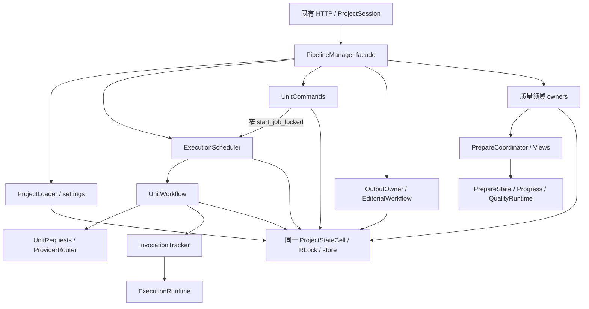

# Pipeline 架构与行为保持验收说明

## 范围与当前状态

本次将原 `pipeline.py` 的领域逻辑迁入明确 owner 和规则模块。HTTP/JSON、项目文件格式、公开构造与方法、用户工作流及既有失败语义保持；不调整模型、提示词、数据格式或业务规则。

- 原始基线：`67de1e069eb96f398f632659626eac846b372847`，原 `pipeline.py` 8887 行。
- 实施分支：`codex/pipeline-refactor`。
- 隔离工作树：`C:/Users/O4/.codex/worktrees/pipeline-refactor/Mode2_AutoTranslator_MVP_public_release_candidate_20260927`。
- 原桌面工作目录及真实 `book/`、`.runtime/` 没有用于测试或本次实现。所有新增行为测试使用临时目录和明确注入的离线 Provider。
- 当前项目加载、设置、单元执行与人工命令、调度、路由、输出、editorial、质量卡片/批次/lookup/resolution/commit/queries 均已逐批独立验收。
- 质量 Views 与 prepare coordinator 已完成接线并独立验收；facade 遗留 import/空段已清理，当前 `pipeline.py` 为 985 行。全部领域迁移及最终清理已通过总验收，交付于 `codex/pipeline-refactor`，未合并或推送。
- 最终核实原桌面 `main` 仍 clean，HEAD 仍为原始 `67de1e0`。

工程流程使用 `code-quality-workflow`；Library 路由 `code-quality-workflow`，ST-A0，snapshot `2026-08-18`。用户已明确授权行为保持重构连续实施；各批通过独立源码、AST 和离线测试验收后提交。

## 状态与资源只有一个 owner

`ProjectStateCell` 严格只有 `state`、原 `RLock`、`ProjectStore`、`closed` 四项。领域对象在使用时读取 `cell.state`，项目切换直接替换这一个引用，避免旧项目快照成为常驻状态。Facade 的 `state`、`_closed` 是明确属性委托，lock/store 仍指向同一原始对象。

`save_project` 只有原 closed guard 和原 store.save；`append_event` 保持事件字段、时间点、JSON 顺序以及最多 160 项的裁剪。它们不获取新锁、不归一化状态、不计算统计，也不提供通用事务框架。

| 资源 | 唯一归属 | 内容 |
| --- | --- | --- |
| 持久化项目 | `ProjectStateCell` | 当前 state 引用、原锁、store、closed |
| 单元运行资源 | `ExecutionRuntime` | executor/并发数、active unit/Future/meta、run cancel Event、stop Timer、retired executor、invocation map |
| Provider 注入 | `ProviderBindings` | translation、review、quality generation/check/editorial/resolution 六字段 |
| 质量临时所有权 | `QualityRuntime` | batch/retry/parallel/prepare inflight 标记，以及一个不落盘的 live progress |
| PDF 字形预检缓存 | `OutputOwner` | 基于当前单元与字体资源签名的只读缓存 |

运行资源没有复制回 facade。领域对象不持有 `PipelineManager`，不通过万能 context、`getattr` 代理或 bound manager callback 访问整个控制器。

## 领域边界

| 模块 / owner | 负责的行为 | 明确依赖 |
| --- | --- | --- |
| `project_loading.ProjectLoader` | legacy load、重启恢复、manifest 回填、新状态反馈字段归一化 | cell、factory、importer、segmenter、runtime_dir、clock |
| `project_settings` | 设置读取、canonical/legacy 参数解析、调用方锁内配置写入 | state/config、cell；不依赖 scheduler |
| `unit_state` / `unit_validation` | 单元规则、反馈/修复记录、状态 mutation、严格导入校验、统计投影 | 显式 state/unit/result、cell/clock；不是新的常驻服务 |
| `UnitRequests` | 来源上下文、结构角色、冻结参考、各阶段提示词与请求 | cell、窄 prompt settings、clock |
| `ProviderRouter` | 六 task 的 override → group 配置路由及 Provider 构建 | cell、bindings、窄 config settings、动态 factory supplier |
| `UnitWorkflow` | translation → independent review，以及 repair 的报告和提交 | cell、requests、router、四方法 invocation/cancel 端口、clock |
| `InvocationTracker` | begin/end/current/cancel 四项调用所有权操作 | cell、ExecutionRuntime、invocation id factory |
| `ExecutionScheduler` | scope 冻结、排队、submit/Future callback、stop/grace/run 生命周期 | cell、runtime、UnitWorkflow、clock、明确 execution factories |
| `UnitCommands` | 保存人工译文、显式复检、重译、edit/accept-risk/retry 裁决 | cell、runtime、scheduler.start_job_locked 窄 callable、clock |
| `OutputOwner` | readiness、artifact/export、hash/trace/metadata、glyph 缓存 | cell、assembler、runtime_dir、clock、明确 exporter 资源 |
| `EditorialWorkflow` | 保存译文的局部建议、请求冻结、返回 freshness 校验 | cell、router |
| `QualityCards` / `QualityQueries` | 卡片操作/审批、reference mode、质量读取、扫描规划及影响查询 | Cards 为 cell/clock；Queries 仅 cell |
| `QualityBatchWorkflow` | bounded scan、check-only retry、generation failure/recovery、批次事务 | cell、quality runtime/progress、router、clock |
| `PrepareState` / `PrepareProgress` | prepare identity/fingerprint/repair guard、记录事务、live progress | cell、quality runtime/progress、clock |
| `PrepareRecheck` / `PrepareLookup` | 已有卡片复检、扩查和已确认 lookup 去重 | cell、prepare state/progress、router、clock |
| `PrepareResolution` / `PrepareCommit` | 全组/逐单元辨析、自动参考采纳与最终 prepare commit | Resolution 为 cell/state/progress/router；Commit 为 cell/state/progress/clock |
| `PrepareViews` | read-only preview、record summary、live status 投影 | cell、quality runtime、queries、id factory |
| `PrepareCoordinator` | plan/execute/resolve/commit 的 confirmed prepare 流程，原 bounded batch executor 编排 | cell、quality runtime/progress/state、明确 queries/views/batches/recheck/lookup/resolution/commit owners、clock/id/executor/completed-future suppliers |
| 质量规则模块 | content/candidate、plan/record/limits、request/recovery/state 规则 | 显式输入；无 manager 回导 |

依赖保持单向：scheduler 执行 workflow；workflow 通过 invocation 端口读取取消和调用身份，不反向调用 scheduler。人工命令只有明确 enqueue callable；配置规则没有 scheduler 字段。质量 owner 使用其真实依赖，领域间不通过 facade 私有桥绕行。



## 锁、调用与持久化契约

- 构造器加载继续使用原调用顺序，不给 loader 增加新锁。load 的 state 替换、migration event、manifest、prepare interruption、stats、save 顺序保持。
- Provider 调用与锁的相对位置保持。translation validation 仍在锁外使用原 unit 引用；最终 translation commit 保留原 cancel guard，不新增 revision guard。review 的锁内校验与随后独立锁内 commit 保持。
- 每个 Run 在首次 submit 前冻结完整 scope；同步完成 Future、提交故障、逐单元完成以及 run status/save 时点保持。
- stop 的原 5 秒 grace、executor retirement、queued/active 取消、旧 worker 与旧 Timer 的迟到隔离保持。关闭与 ProjectSession 删除继续保留各自原 eligibility 条件。
- 设置更新保持原 outer RLock 与返回 public read 的 nested RLock。并发数更新的 scheduler.close/config/event/save 属于一个原锁段；context/segmentation updates 不重切分或清除译文。
- Manual save 没有新增 rollback：save 失败时内存人工修改及事件保留，磁盘保持旧状态。translation/review result commit、输出发布和质量批次的失败路径继续保持各自原恢复行为。
- 重切分仍要求明确 confirm_reset，先备份再构建替换；保存后才刷新返回 snapshot 的统计，因此旧的磁盘 stats 与返回投影差异保留。
- Legacy max_segment_words load 只读，不写入 canonical 字段。Manifest 仅在 id/order/source hash 三绑定全部匹配时回填，不替换或重排已有 units。
- task → group 六路 Provider 路由、partial/falsey 注入、构建时读取时点保持；提示词和 reference 在原阶段冻结，自动 review 复用原 translation reference。
- 动态 clock、executor/Event/Timer/id/stop grace、Provider/exporter factory 和 glyph patch 点继续在原调用点读取 pipeline 模块符号。
- accepted-risk 的人工修改保留风险状态；直接复检仍拒绝，重译仍走正常 translation → review。decide edit 保留原 manual 字段及独立复检后状态语义。
- Prepare 身份绑定 project/mode/prepare id，自己的全局 revision 递增不使 run 失效；每次 repair 请求前同时校验 identity 及原 cards/source freshness，迟到结果保持原拒绝行为。
- 增量 checkpoint 保留成功批次；失败恢复要求明确 retry，未成功检查的生成结果不自动采纳。额外 lookup 与 local judgment 共用一个 logical-request budget，调用前扣减，失败也消耗。
- Local 判断携带完整争用集合，不为满足请求上限截断；manual 参考保护、决策幂等及 reference revision 仅随实际变化递增保持。
- Quality commit 保存失败恢复旧 support 和完整 events；reference mode 先修改 project，因此该路径失败时内存 mode 仍保新值而磁盘旧 mode 保留。原事务边界没有被扩大成全 state rollback。

## 已完成阶段的提交索引

| 领域阶段 | 已验收提交 |
| --- | --- |
| 单元校验、路由、共享 cell、request/feedback | `afba224`、`dd59816`、`ecf1b64`；相关后续提交见本分支 git 历史 |
| execution resources、UnitWorkflow、完整 Scheduler | `d994d65`、`8a9b8af`、`721f3e8` |
| editorial / 输出 owner | `180460c`、`4892c9c` |
| 质量扫描/recovery、prepare guard/recheck/lookup/resolution/commit | `628ae94`、`9a44b5e`、`bb37a31`、`ec19f74`、`d340f16`、`94021a8`、`f7578e8` |
| 项目 loader、新状态构建、legacy 恢复 | `a9e768a` |
| project settings 及共用 context 规则 | `9ea0820` |
| quality queries / limits | `64a1f43` |
| manual save/review/retranslate/decide | `89ca1a8` |
| prepare Views / confirmed coordinator | `65ab509`、`4b34591` |

每个迁移批按明确资源/clock/函数归属映射对照迁移前后正文 AST，并对 facade retained methods 做 wiring-only 对照；原注释和多行格式保留。该静态证据与行为测试互补，不代替实际执行。

## 验收证据

原始基线为 42 Python + 4 JS 通过。最终清理后，主 Agent 独立总验收结果为 **164 Python + 4 JS 通过**；**97 Python / 9 JS syntax** 通过，eager 与包含延迟导入并排除 TYPE_CHECKING 的 runtime SCC 均为 **[]**，32 个新增 core 模块的 leaf-first 与 facade-first fresh imports 通过，git diff --check 通过。

最后清理前后，全部 module functions 与 class methods 的 AST 精确相同；33 个原 public method signatures 对原始基线保持。实施者最后 25 项定向路由/输出/共享状态契约也通过。本次验证完成；各阶段提交见本分支历史。

可直接复跑基础套件：

```powershell
python -B -m unittest discover -s tests -p "test_*.py"
node --test tests/test_session_request.cjs
```

公开行为测试覆盖：

| 范围 | 主要证据 |
| --- | --- |
| 单元执行与 routing | 成功 T→R、binding/shape 拒绝顺序、合法 FAIL、六任务 override/group、partial/falsey 注入 |
| 人工与 repair lifecycle | 版本/source guard、显式 recheck、retained draft 一次消费、accepted-risk、真实 adapter + fake HTTP 的 bounded repair、commit/save failure |
| Run 与取消 | 真实双 worker/Event、完整 scope、同步 callback、submit failure、queued/active/auto-review cancel、grace timeout、迟到 worker/Timer、session deletion |
| 项目与设置 | legacy/crash load、provider migration once、manifest 三绑定、confirm/backup/resegment、输入解析、单侧零 context、并发 idle guard/原失败保存 |
| Output 与 editorial | readiness、真实 text/markdown artifact/hash/trace、metadata/event、发布/保存失败差异、glyph cache、建议 request freeze 与 stale reject |
| 质量工作流 | scan/retry/card 事务、generation/check 分离、prepare confirmed scope、并行预算、foreign writer guard、lookup dedup、resolution freshness、automatic adoption/idempotence |

新增测试使用 TemporaryDirectory、明确离线 Provider、socket guard、Event/受控 Timer；不调用真实模型或外部服务。已有 HTTP 路由测试使用进程内 TestClient。验证的是原用户工作流和持久化结果，避免仅断言新实现的内部形状。

## Facade 保留的真实协调

`PipelineManager` 继续作为既有 API 和对象装配入口。create/import/resegment 必须串联项目 idle guard、executor 关闭、source 保存/备份、state 替换与返回 snapshot；并发设置需要关闭 scheduler；output readiness 的 glyph 资源继续保留原模块 patch 点。这些协调留在原锁段，未为追求行数另造 ProjectService 或拆开原子事务。

最终清理仅移除 68 个无调用 import 名、无消费者的 `_TECHNICAL_REVIEW_PROVIDER` 和迁移后空段/过时注释；保留实际公开 constants/status aliases、Provider/exporter factory 和 glyph patch 点。清理前后全部模块函数与 class methods 的 decorators/args/body AST 精确相同，未改方法逻辑、锁或调用顺序。

对原基线，33 个原 public methods 的签名全部保持。state/provider 属性明确委托到 cell/bindings；`has_live_work_locked` 供 ProjectSession 在原双锁删除流程中查询。`app.py`、storage、api_settings、prompts、api_provider、quality_provider 的实现保持原样。

本阶段证据仅为离线源码、适配器、线程/存储与进程内 HTTP 验收；没有做真实模型效果评估、浏览器宿主验收、发布、推送或合并。全部迁移与最后清理已通过总验收，交付于 `codex/pipeline-refactor`，未合并或推送。
